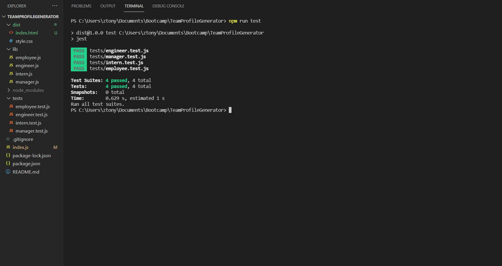

# Team Profile Generator
The aim of this project is to create a team profile generator application that collects input via inquirer prompts on command line. The user is first prompted with information of a manager, then the user is prompted with a menu with options of adding an engineer, intern or finish. The user can freely add as many engineer or intern as desired. When the user selects finish option, a html file is generated displaying profiles as cards.
​
<br/>

### Prerequisites
​
The application uses node.js. For download and installation procedure, see [Link](https://nodejs.org/en/download/).


<br/>

### Installing

To use the application, the user should open terminal/git bash, locate the ReadmeGenerator folder, perform ```npm install``` to install the required packages (inquirer). After installation completes, user may initiate the application with command ```node index.js```.

<br/>

## Built With

* Javascript

* CSS

​<br/>

## Application Code

View javascript comments.

## Demonstration

See demo.mp4
[](https://youtu.be/qeQaUVta9OU)


## Authors

* **Tony Zhang** 
- [Link to Portfolio Site](https://tonyzyt9947.github.io/PersonalPortfolio/)
- [Link to Github](https://github.com/Tonyzyt9947)
- [Link to LinkedIn](https://www.linkedin.com/in/tony-zhang-61670421b/)
​
<br/><br/>

## License
​
This project is licensed under the MIT License 
​
<br/><br/>
## Acknowledgments
* Node.js 
